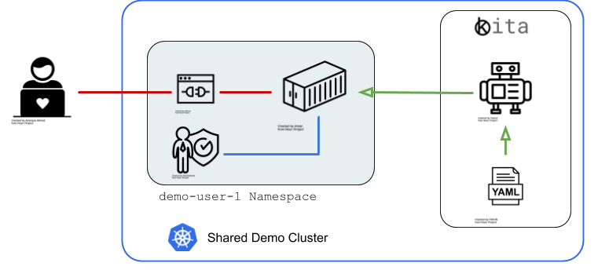

# KITA


KITA is a  
**K**ubernetes operator for building  
**I**nstructor-led  
**T**utorials and  
**A**wesome demos.

It is also a common abbreviation for the German word ["Kindertagesstätte"](https://de.wikipedia.org/wiki/Kindertagesst%C3%A4tte) (Day Care).

## General Idea



The goal of Kita is to enable declarative specifications for quicky hosting lab environments for hands-on sessions and other tutorials. The Kita Operator uses the Resource Specifications to setup an all-browser-based environment using [Coder](https://coder.com/) and a Service Account with namespace administrator priviledges.

## Installation

Deploy the Kita CRD

```bash
kubectl apply -f deploy/crds
```

Create the Service Account, ClusterRoleBinding and Operator Deployment

```bash
kubectl apply -f deploy/service_account.yaml
kubectl apply -f deploy/cluster_admin_binding.yaml
kubectl apply -f deploy/operator.yaml
```

## Kita Space CR Example

```yaml
apiVersion: kita.danistrebel.io/v1alpha1
kind: KitaSpace
metadata:
  name: awesome-space
spec:
  owner:
    name: john
    email: john.doe@example.com
  repos:
    - https://github.com/ramitsurana/awesome-kubernetes.git
    - https://github.com/operator-framework/awesome-operators
    - https://github.com/danistrebel/kita-oc-cli
  platform: openshift #OPTIONAL
  token: changeit # OPTIONAL
```

## Result

The Kita operator creates a Password protected workspace for each user.


After entering the password, the user can enter a web-based code editor with all specified GIT repositories checked out. 


## (Optional) Sendgrid Integration for Space Login Token

The operator can send the login token via email to the Kita Space Owner (as specified in the KitaSpace resource). To do that, you need to obtain a [Sendgrid](https://sendgrid.com/) API-key and set the following environment parameters:

```bash
export SENDGRID_API_KEY='SG.xxxxxREPLACE_THIS_TOKENxxxxx'
export SENDGRID_EMAIL_SENDER='sender@example.com'
```

Note that there is a [free usage quota for Sendgrid](https://sendgrid.com/pricing/) (100/day at the time of writing).
